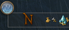

# CHANGELOG

## Unreleased

- feat: Add Crafting (Synthesis) window to hiding options

## 1.14.0

- Update to API 5, EW support

## 1.13.0 

- fix: Missing ImGui.End() when 'Drawing Cardinals only'
- feat: Expose minimal scaling factor as an option
- feat: Add filtering ids (thanks for the reports!):
  - Various in residential Area
  - Delivery Moogle
  - Settlement
  - Ferry

## 1.11.0

- feat: Update to API4
- feat: Show distance to target on compass

## 1.8.2

- fix: Potential compass crash after e.g. Chocobo race, Lord of Vermillion match, DeepDungeon etc.
- fix: Add more botanist, fisher and miner icons to special rotation handling
- fix: Add locked quest to rotation handling

## 1.8.0

- feat/fix: Add new commands which toggle/on/off compass _and_ save that (#5).  
  The existing commands 'toggle|on|off' were intended to be permanent but I messed up and forgot
  to include the configuration save into them. Changing that now is technically a breaking change, however,
  I do not feel like it makes sense to make that breaking. Instead, three new commands 'togglep|onp|offp'
  (note the added 'p' for permanent)
  are introduced which work the same way albeit this time they do save the configuration.

## 1.7.1

- feat: Optionally show weather on compass (closing #3)  
  

## 1.6.1

- fix: Icons are no longer cut off along the Y axes when e.g. scaled or close.

## 1.6.0

- feat: Add option to only show cardinals.
- feat: Add chocobro companion, party member dot and enemy dot to filter list.
- feat: Add a mask percentage to visually cut off part of the compass.
  
- fix: Update NaviMap/AreaMap reference on configuration change too.
  This allows one to easily reset the cached variables by enabling/disabling the compass.
  The cache e.g. needs to be reset after a DeepDungeon visit.
- fix: Add Gemstone trader to 'Shops' filter (closing #2)

## 1.0.0

- feat: Release

## 0.10.1-testing

- feat: Add filters
- fix: Various fixes under the hood

## 0.8.4-testing

- fix: Compatibility update to work with newest dalamud

## 0.8.1-testing

- feat: Position compass with X/Y values and center horizontally via a button
- feat: More hiding options
- feat: Line as background
- feat: Offset for cardinals
- feat: Scale in .01 units instead of .1
- fix: Miner gathering nodes should now be correctly handled 
- fix: Botanic gathering nodes should now be correctly handled
- fix: Glowing thingy under icons should now be correctly handled and spinning
- fix: Camera rotation is discarded in favour of reading the rotation from NaviMap
    This should fix the 'static' compass errors
- fix: 'Hide Compass in Combat' now properly checks even if no other hiding options are set

BREAKING:
- Default size for icons is now 8 pixel bigger.

## 0.5.9-testing

- feat: Hiding options are now its own tab
- fix: Crash bug on default install
- Various other small fixes

## 0.4.0-testing

- First testing release with basic functionality