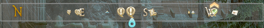
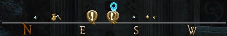
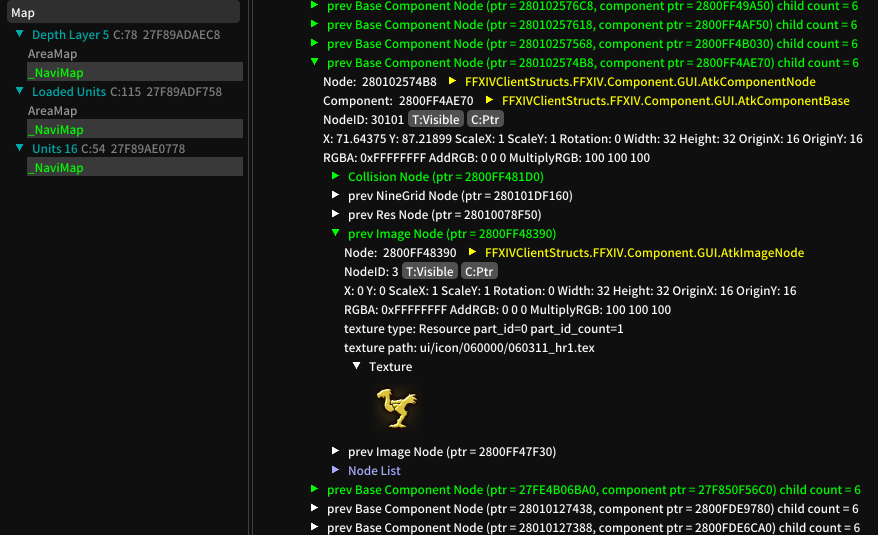

# Compass

A Final Fantasy XIV Dalamud plugin.
Shows a monodimensional compass to augment/replace the minimap.

Licensed under AGPLv3 or later.

### Know Issues

- Not all icons which need special handling got it. Please see below on how to report issues.
- Not all desirable windows for hiding the compass are implemented. Please see below on how to request new ones.
- Not all desirable filters are implemented yet. Please see below on how to request new ones.

### Requesting/Reporting new filters/windows/issues

Please include in your request/report the `iconid` of the icon
to be filtered/the icon wrongly handled/the name of the window
and whether it should be its own setting or added to an already existing one.
To obtain the `iconid`, open the AddonInspector via `/xldata ai`,
search for `Map`, click `_NaviMap->NodeList->[2] Base Component Node ... child count = 206`
and look through the list of green nodes until you find the one with the icon
(if you mouse over a green entry it should highlight what it is on the mini map).
When you found the correct one, open it up until you have the texture (see picture).
The texture path contains the needed `iconid`.
Adjust for AreaMap accordingly if you are using that.

For the window name, you need to be a bit creative. If the window is currently focused,
there is a good chance its under `Focused Units`.
That is not always true though. 